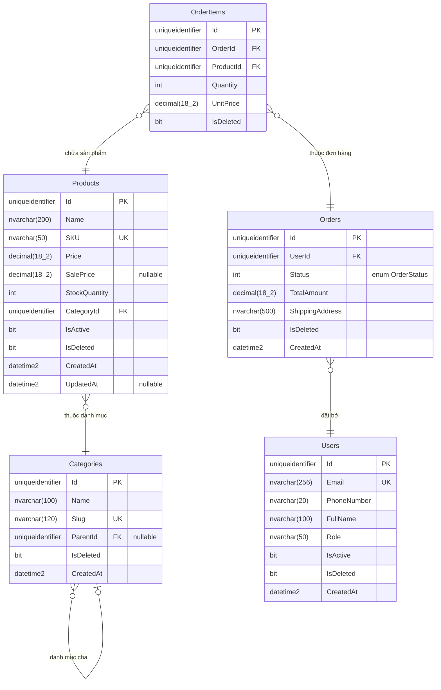

# CODING RULES — ToyStore Clean Architecture

> Đây là file quy tắc kiến trúc bắt buộc. Khi được tag vào, AI PHẢI tuân thủ 100% nội dung bên dưới.
> KHÔNG được phá vỡ cấu trúc, KHÔNG tự ý thay đổi pattern, KHÔNG refactor code hiện tại.

---

## 1. Kiến trúc Solution

```
ToyStore.sln
├── ToyStore.API              → Presentation Layer (Controllers, Middleware)
├── ToyStore.Application      → Application Layer (DTOs, Interfaces, Validators)
├── ToyStore.Domain           → Domain Layer (Entities, Enums) — LAYER LÕI
├── ToyStore.Infrastructure   → Infrastructure Layer (Repositories, Services, Data)
├── ToyStore.Chatbot          → Module Chatbot
├── ToyStore.Recommendation   → Module Recommendation
└── ToyStore.Worker           → Background Worker
```

### Luật tham chiếu giữa các layer

```
API → Application, Infrastructure, Chatbot, Recommendation  ✅
Application → Domain (CHỈ Domain)                           ✅
Infrastructure → Application, Domain                        ✅
Domain → KHÔNG tham chiếu project nào                       ✅

Application → Infrastructure                                ❌ CẤM
Domain → bất kỳ layer nào                                   ❌ CẤM
```

---

## 2. Cấu trúc thư mục — File phải đặt ĐÚNG vị trí

```
ToyStore.Domain/
├── Entities/                → Entity classes, kế thừa AuditableEntity
└── Enums/                   → Enum types

ToyStore.Application/
├── DTOs/
│   ├── Products/            → ProductDto.cs, CreateProductDto.cs, ...
│   ├── Orders/              → OrderDto.cs, CreateOrderDto.cs, ...
│   └── [Features]/          → Mỗi feature 1 folder riêng (số nhiều)
├── Interfaces/
│   ├── Services/            → IXxxService.cs
│   └── Repositories/        → IXxxRepository.cs
├── Validators/
│   ├── Products/            → CreateProductValidator.cs, UpdateProductValidator.cs
│   ├── Orders/              → CreateOrderValidator.cs, ...
│   └── [Features]/          → Mỗi feature 1 folder riêng (số nhiều)
└── Common/
    ├── Exceptions/          → Custom exceptions
    ├── Extensions/          → Extension methods
    ├── Helpers/             → Helper classes
    └── Models/              → Shared models

ToyStore.Infrastructure/
├── Data/
│   ├── ToyStoreDbContext.cs
│   └── Configurations/     → EF Core Fluent API configurations
├── Repositories/            → XxxRepository.cs (implement IXxxRepository)
├── Services/                → XxxService.cs (implement IXxxService)
└── DependencyInjection.cs   → Đăng ký DI TẤT CẢ ở đây

ToyStore.API/
├── Controllers/             → XxxsController.cs (số nhiều)
├── Extensions/
├── Middleware/
└── Program.cs

docs/
├── tests/                   → [feature]_test.md
└── database/
    ├── erd.md               → Sơ đồ ERD (Mermaid) — luôn phản ánh schema hiện tại
    └── CHANGELOG.md         → Lịch sử migration theo thứ tự thời gian
```

---

## 3. Patterns bắt buộc

### 3.1 Entity (Domain Layer)

- Kế thừa `AuditableEntity` (đã có sẵn: `Id`, `CreatedAt`, `UpdatedAt`, `IsDeleted`, `DeletedAt`, `CreatedBy`, `UpdatedBy`)
- `AuditableEntity` kế thừa `Entity` (có sẵn `Guid Id` auto-generate)
- Có XML summary comment cho mỗi property
- Namespace: `ToyStore.Domain.Entities`

```csharp
namespace ToyStore.Domain.Entities;

public class Feature : AuditableEntity
{
    /// <summary>
    /// Mô tả property.
    /// </summary>
    public string Name { get; set; } = string.Empty;

    // Navigation properties
    public virtual ICollection<Child> Children { get; set; } = new List<Child>();
}
```

### 3.2 DTO (Application Layer)

- Mỗi feature 1 folder riêng, tên **số nhiều**: `DTOs/Products/`, `DTOs/Orders/`
- Mỗi DTO 1 file riêng trong folder đó — chứa toàn bộ CRUD DTOs:
  - `[Entity]Dto.cs` — Full read
  - `Create[Entity]Dto.cs` — Create request
  - `Update[Entity]Dto.cs` — Update request (all properties nullable)
  - `[Entity]ListDto.cs` — Lightweight cho danh sách
- Namespace: `ToyStore.Application.DTOs.[Features]`

```
DTOs/
├── Products/                ← Tất cả CRUD DTOs của Product
│   ├── ProductDto.cs
│   ├── CreateProductDto.cs
│   ├── UpdateProductDto.cs
│   └── ProductListDto.cs
├── Orders/                  ← Tất cả CRUD DTOs của Order
│   ├── OrderDto.cs
│   ├── CreateOrderDto.cs
│   └── OrderListDto.cs
└── Common/
    ├── ApiResponse.cs
    └── PaginatedResponse.cs
```

### 3.3 Validator (Application Layer) — BẮT BUỘC ĐẦY ĐỦ

> ⚠️ **MỌI CreateDto và UpdateDto đều PHẢI có Validator tương ứng. KHÔNG ĐƯỢC bỏ qua.**

- Mỗi feature 1 folder riêng (số nhiều) trong `Validators/[Features]/`
- Mỗi DTO cần validate → 1 file Validator riêng: `Create[Entity]Validator.cs`, `Update[Entity]Validator.cs`
- Validator **BẮT BUỘC** kế thừa `AbstractValidator<T>` từ thư viện **FluentValidation**.
- Namespace: `ToyStore.Application.Validators.[Features]`

**NGUYÊN TẮC: Validator phải nghĩ như BUSINESS ANALYST, không chỉ là developer.**
Validate không chỉ kiểm tra null/empty — mà phải đảm bảo DỮ LIỆU HỢP LỆ VỀ MẶT NGHIỆP VỤ.

#### A. Validate theo kiểu dữ liệu (BẮT BUỘC cho MỌI field):

| Kiểu dữ liệu | Phải validate |
|---------------|---------------|
| `string` | Null/empty, min length, max length, format (regex nếu cần) |
| `decimal` / `int` | Giá trị > 0, min, max, giới hạn hợp lý |
| `Guid` | Không được `Guid.Empty` |
| `DateTime` | Không được quá khứ / tương lai (tuỳ logic) |
| `enum` | Giá trị hợp lệ (nằm trong range) |
| `List<T>` | Null check, max items, validate từng item |
| `string?` (nullable) | Nếu có giá trị → validate length/format |

#### B. Validate logic nghiệp vụ (BẮT BUỘC — QUAN TRỌNG NHẤT):

> ⚠️ **Áp dụng cho TẤT CẢ chức năng, TẤT CẢ entity — KHÔNG CÓ NGOẠI LỆ.**
> Khi tạo bất kỳ feature nào (Product, Order, User, Review, Coupon, Payment, ...) đều PHẢI validate đầy đủ.

**Checklist bắt buộc cho MỌI Validator (áp dụng chung):**

- ✅ Mọi field bắt buộc → kiểm tra null/empty
- ✅ Mọi field string → kiểm tra min/max length
- ✅ Mọi field string có format đặc biệt → regex (email, SĐT, SKU, URL, ...)
- ✅ Mọi field số → kiểm tra giá trị hợp lý (> 0, min, max, giới hạn thực tế)
- ✅ Mọi field số tiền (VND) → giới hạn hợp lý, không âm
- ✅ Mọi field Guid → không được `Guid.Empty`
- ✅ Mọi field DateTime → hợp lệ (không tương lai/quá khứ tuỳ ngữ cảnh)
- ✅ Mọi field enum → giá trị nằm trong range hợp lệ
- ✅ Mọi field List → max items, validate từng item bên trong
- ✅ Mọi cặp field liên quan → cross-field logic (Min < Max, Start < End, Sale < Price, ...)
- ✅ SĐT Việt Nam → bắt đầu bằng 0, đúng 10 số
- ✅ Email → đúng format RFC
- ✅ URL → đúng format http/https
- ✅ Mật khẩu → tối thiểu 8 ký tự, chữ hoa + chữ thường + số

**Ví dụ nghiệp vụ cụ thể (tham khảo, KHÔNG giới hạn ở đây):**

| Feature | Ví dụ logic nghiệp vụ |
|---------|----------------------|
| Product | SalePrice < Price, StockQuantity >= 0, MinAge < MaxAge, Price < 100tr |
| Order | Quantity > 0, TotalAmount = Price × Qty, Address bắt buộc |
| User | Email unique (ở Service), SĐT VN format, Password strength |
| Review | Rating 1-5, Content min length, không review sản phẩm chưa mua |
| Coupon | Discount 1-99%, StartDate < EndDate, MinOrderValue hợp lý |
| Payment | Amount > 0, Amount khớp Order total |
| Category | Name unique, không tự reference parent |
| **Bất kỳ** | **Áp dụng toàn bộ checklist bên trên — không bỏ sót field nào** |

#### C. Ví dụ mẫu đầy đủ:

```csharp
using FluentValidation;

namespace ToyStore.Application.Validators.Products;

public class CreateProductValidator : AbstractValidator<CreateProductDto>
{
    public CreateProductValidator()
    {
        // ═══ VALIDATE DỮ LIỆU CƠ BẢN ═══

        // Tên sản phẩm
        RuleFor(x => x.Name)
            .NotEmpty().WithMessage("Product name is required.")
            .MinimumLength(3).WithMessage("Product name must be at least 3 characters.")
            .MaximumLength(200).WithMessage("Product name must not exceed 200 characters.");

        // Mã SKU — format chuẩn
        RuleFor(x => x.SKU)
            .NotEmpty().WithMessage("SKU is required.")
            .Matches(@"^[A-Z0-9\-]+$").WithMessage("SKU must contain only uppercase letters, numbers, and hyphens.");

        // Danh mục
        RuleFor(x => x.CategoryId)
            .NotEmpty().WithMessage("Category is required.");

        // ═══ VALIDATE LOGIC NGHIỆP VỤ ═══

        // Giá — phải hợp lý
        RuleFor(x => x.Price)
            .GreaterThan(0).WithMessage("Price must be greater than 0.")
            .LessThanOrEqualTo(100_000_000).WithMessage("Price must not exceed 100,000,000 VND.");

        // Giá khuyến mãi — phải nhỏ hơn giá gốc
        RuleFor(x => x.SalePrice)
            .GreaterThan(0).WithMessage("Sale price must be greater than 0.").When(x => x.SalePrice.HasValue)
            .Must((dto, salePrice) => !salePrice.HasValue || salePrice.Value < dto.Price)
            .WithMessage("Sale price must be less than the original price.");

        // Tồn kho — không âm
        RuleFor(x => x.StockQuantity)
            .GreaterThanOrEqualTo(0).WithMessage("Stock quantity must not be negative.");

        // Tuổi — MinAge < MaxAge
        RuleFor(x => x)
            .Must(x => !x.MinAge.HasValue || !x.MaxAge.HasValue || x.MinAge.Value < x.MaxAge.Value)
            .WithMessage("Minimum age must be less than maximum age.")
            .When(x => x.MinAge.HasValue && x.MaxAge.HasValue);

        // URL ảnh — đúng format
        RuleFor(x => x.ImageUrl)
            .Must(uri => Uri.IsWellFormedUriString(uri, UriKind.Absolute))
            .WithMessage("Image URL is not valid.")
            .When(x => !string.IsNullOrEmpty(x.ImageUrl));
    }
}
```

**Cách dùng trong Service:**
```csharp
var validator = new CreateProductValidator(); // Hoặc inject IValidator<CreateProductDto>
var validationResult = await validator.ValidateAsync(dto, cancellationToken);
if (!validationResult.IsValid)
{
    var errors = validationResult.Errors
        .GroupBy(e => e.PropertyName)
        .ToDictionary(g => g.Key, g => g.Select(e => e.ErrorMessage).ToArray());
    return Result<ProductDto>.ValidationFailure(errors);
}
```

**KHÔNG ĐƯỢC:**
- ❌ Tạo DTO mà không có Validator
- ❌ Validate chỉ 1-2 field rồi bỏ qua các field còn lại
- ❌ Bỏ qua validate cross-field logic (SalePrice < Price, MinAge < MaxAge, ...)
- ❌ Quên validate string length, số âm, Guid.Empty
- ❌ Chỉ validate format mà bỏ qua logic nghiệp vụ (giới hạn giá, tuổi, số lượng, ...)
- ❌ Validate sơ sài — mỗi field PHẢI được validate ĐẦY ĐỦ tất cả case có thể xảy ra

### 3.4 Interface (Application Layer)

- Service interface → `ToyStore.Application.Interfaces.Services/IXxxService.cs`
- Repository interface → `ToyStore.Application.Interfaces.Repositories/IXxxRepository.cs`
- Tất cả method async có `CancellationToken cancellationToken = default`
- Có XML summary comment

### 3.5 Repository (Infrastructure Layer)

- Implement interface từ Application layer
- Inject `ToyStoreDbContext` qua constructor
- Luôn filter `!x.IsDeleted` (soft delete)
- Namespace: `ToyStore.Infrastructure.Repositories`

```csharp
public class FeatureRepository : IFeatureRepository
{
    private readonly ToyStoreDbContext _context;
    private readonly DbSet<Feature> _dbSet;

    public FeatureRepository(ToyStoreDbContext context)
    {
        _context = context;
        _dbSet = context.Set<Feature>();
    }
}
```

### 3.6 Service (Infrastructure Layer)

- Implement interface từ Application layer
- Inject repository (qua interface) + `ILogger<T>`
- Namespace: `ToyStore.Infrastructure.Services`

### 3.7 Controller (API Layer)

- Kế thừa `ControllerBase`
- Attributes: `[ApiController]`, `[Route("api/[controller]")]`
- Inject service (qua interface) + `ILogger<T>`
- Return: `ActionResult<ApiResponse<T>>` hoặc `ActionResult<ApiResponse>`
- Dùng wrapper: `ApiResponse<T>.Ok(data)` / `ApiResponse<T>.Fail(msg)` / `ApiResponse.Ok(msg)` / `ApiResponse.Fail(msg)`
- Namespace: `ToyStore.API.Controllers`

```csharp
[ApiController]
[Route("api/[controller]")]
public class FeaturesController : ControllerBase
{
    private readonly IFeatureService _featureService;
    private readonly ILogger<FeaturesController> _logger;

    public FeaturesController(IFeatureService featureService, ILogger<FeaturesController> logger) { ... }

    [HttpGet("{id:guid}")]
    public async Task<ActionResult<ApiResponse<FeatureDto>>> GetById(Guid id, CancellationToken cancellationToken)
    {
        var result = await _featureService.GetByIdAsync(id, cancellationToken);
        if (result == null)
            return NotFound(ApiResponse<FeatureDto>.Fail("Feature not found"));
        return Ok(ApiResponse<FeatureDto>.Ok(result));
    }
}
```

### 3.8 Dependency Injection

Đăng ký trong **`ToyStore.Infrastructure/DependencyInjection.cs`** — KHÔNG ở nơi khác:

```csharp
services.AddScoped<IXxxRepository, XxxRepository>();
services.AddScoped<IXxxService, XxxService>();
```

### 3.9 Response Wrapper

Dùng wrapper có sẵn trong `CommonDtos.cs`:
- `ApiResponse<T>.Ok(data, message)` — có data
- `ApiResponse<T>.Fail(message)` — lỗi có data type
- `ApiResponse.Ok(message)` — không data
- `ApiResponse.Fail(message)` — lỗi không data
- `PaginatedResponse<T>` — phân trang

**KHÔNG tạo wrapper mới. KHÔNG sửa wrapper hiện tại.**

### 3.10 Result Pattern (Application Layer)

Project có sẵn `Result<T>` và `Result` trong `Common/Models/Result.cs`.
Dùng cho Service trả về kết quả **thay vì throw exception**:

```csharp
// Trong Service:
return Result<ProductDto>.Success(productDto);                    // Thành công
return Result<ProductDto>.Failure("ERROR_CODE", "Mô tả lỗi");    // Lỗi chung
return Result<ProductDto>.NotFound("Product", id);                // Không tìm thấy
return Result<ProductDto>.ValidationFailure(errors);              // Lỗi validation
return Result<ProductDto>.BusinessError("Mô tả lỗi nghiệp vụ"); // Lỗi business rule
return Result<ProductDto>.Conflict("Dữ liệu bị xung đột");      // Xung đột data
return Result<ProductDto>.Unauthorized();                         // Không có quyền
```

**Trong Controller**, dùng extension method `.ToActionResult()` để convert:

```csharp
var result = await _service.CreateAsync(dto, cancellationToken);
return result.ToActionResult();       // Tự map ErrorCode → HTTP status
return result.ToCreatedResult(uri);   // 201 Created nếu success
return result.ToNoContentResult();    // 204 NoContent nếu success
```

**KHÔNG tạo Result class mới. Dùng cái có sẵn.**

### 3.11 Custom Exceptions (Application Layer)

Project có sẵn các exception trong `Common/Exceptions/ApplicationExceptions.cs`.
Dùng khi cần throw exception (thay vì Result pattern):

| Exception | Khi nào dùng |
|-----------|-------------|
| `NotFoundException` | Không tìm thấy resource |
| `ValidationException` | Dữ liệu không hợp lệ |
| `BusinessRuleException` | Vi phạm quy tắc nghiệp vụ |
| `UnauthorizedException` | Không có quyền truy cập |
| `ForbiddenException` | Bị cấm truy cập |
| `ConflictException` | Xung đột dữ liệu (duplicate, ...) |

```csharp
throw new NotFoundException("Product", id);
throw new BusinessRuleException("Không thể xoá sản phẩm đang có đơn hàng.");
throw ConflictException.DuplicateEntry("SKU", sku);
```

**KHÔNG tạo exception class mới. Dùng các exception có sẵn.**

### 3.12 UnitOfWork & Transaction (BẮT BUỘC)

Project dùng `IUnitOfWork` để quản lý transaction và gom nhiều repository:

```csharp
// Trong Service — inject IUnitOfWork:
public class OrderService : IOrderService
{
    private readonly IUnitOfWork _unitOfWork;

    // Dùng repository qua UnitOfWork:
    var product = await _unitOfWork.Products.GetByIdAsync(id);
    var order = await _unitOfWork.Orders.GetByIdAsync(orderId);

    // Save changes:
    await _unitOfWork.SaveChangesAsync(cancellationToken);
}
```

**Khi thêm Repository mới**, PHẢI thêm property vào `IUnitOfWork` interface và `UnitOfWork` class.

#### Transaction — BẮT BUỘC cho các chức năng quan trọng

> ⚠️ **Mọi thao tác ghi dữ liệu liên quan nhiều bảng/entity PHẢI dùng Transaction. KHÔNG CÓ NGOẠI LỆ.**

**Các trường hợp BẮT BUỘC dùng Transaction:**

| Chức năng | Lý do |
|-----------|-------|
| Tạo đơn hàng (Create Order) | Tạo Order + OrderItems + trừ tồn kho cùng lúc |
| Thanh toán (Payment) | Cập nhật trạng thái Order + ghi Payment record |
| Huỷ đơn hàng (Cancel Order) | Cập nhật trạng thái + hoàn tồn kho |
| Hoàn tiền (Refund) | Cập nhật trạng thái Order + Payment + hoàn tồn kho |
| Cập nhật tồn kho hàng loạt | Nhiều Product cập nhật cùng lúc |
| Xoá entity có quan hệ | Soft delete entity + các entity con liên quan |
| Import/Bulk operations | Tạo/cập nhật nhiều record cùng lúc |
| Chuyển trạng thái phức tạp | Thay đổi trạng thái kéo theo nhiều side effect |
| Tạo entity có quan hệ | Tạo entity cha + entity con cùng lúc |

**Quy tắc chung:** Nếu 1 Service method có **≥ 2 thao tác write** (Add/Update/Delete) → **BẮT BUỘC** dùng Transaction.

**Pattern chuẩn:**

```csharp
public async Task<Result<OrderDto>> CreateOrderAsync(CreateOrderDto dto, CancellationToken cancellationToken)
{
    // Validate trước
    var validation = CreateOrderValidator.Validate(dto);
    if (!validation.IsValid)
        return Result<OrderDto>.ValidationFailure(validation.ToErrorDictionary());

    // BẮT ĐẦU TRANSACTION
    await _unitOfWork.BeginTransactionAsync(cancellationToken);
    try
    {
        // 1. Tạo Order
        var order = new Order { ... };
        await _unitOfWork.Orders.AddAsync(order, cancellationToken);

        // 2. Tạo OrderItems + trừ tồn kho
        foreach (var item in dto.Items)
        {
            var product = await _unitOfWork.Products.GetByIdAsync(item.ProductId, cancellationToken);
            if (product == null)
                return Result<OrderDto>.NotFound("Product", item.ProductId);

            if (product.StockQuantity < item.Quantity)
                return Result<OrderDto>.BusinessError($"Sản phẩm '{product.Name}' không đủ tồn kho.");

            product.StockQuantity -= item.Quantity;
            _unitOfWork.Products.Update(product);

            order.OrderItems.Add(new OrderItem { ... });
        }

        // 3. Lưu tất cả + commit
        await _unitOfWork.SaveChangesAsync(cancellationToken);
        await _unitOfWork.CommitTransactionAsync(cancellationToken);

        return Result<OrderDto>.Success(MapToDto(order));
    }
    catch
    {
        // ROLLBACK nếu có lỗi
        await _unitOfWork.RollbackTransactionAsync(cancellationToken);
        throw;
    }
}
```

**KHÔNG ĐƯỢC:**
- ❌ Thao tác nhiều bảng mà KHÔNG dùng Transaction
- ❌ Quên Rollback trong block catch
- ❌ Commit trước khi SaveChanges
- ❌ Dùng nhiều SaveChanges riêng lẻ thay vì 1 SaveChanges + Transaction

### 3.13 Mapping DTO & Entity (AutoMapper)

Project sử dụng **AutoMapper** để chuyển đổi dữ liệu. KHÔNG được map tay thủ công (trừ các trường hợp custom logic phức tạp).

**Pattern chuẩn:**
1. Khai báo thư mục `ToyStore.Application/Mappings/` và tạo class kế thừa `Profile` theo feature:
```csharp
namespace ToyStore.Application.Mappings;

public class ProductProfile : Profile
{
    public ProductProfile()
    {
        CreateMap<Product, ProductDto>();
        // Ignore hoặc map custom property nếu cần
        CreateMap<CreateProductDto, Product>()
            .ForMember(dest => dest.Slug, opt => opt.Ignore()); 
    }
}
```

2. Cách dùng trong Service:
```csharp
// Inject IMapper vào constructor
private readonly IMapper _mapper;

// Sử dụng:
var dto = _mapper.Map<ProductDto>(product);
var productList = _mapper.Map<List<ProductListDto>>(products);
```

3. Đăng ký trong `DependencyInjection.cs` của Application (nếu có) hoặc API:
`services.AddAutoMapper(Assembly.GetExecutingAssembly());`

### 3.14 Entity Framework Core Migrations

Do sử dụng Clean Architecture, cấu trúc project chia làm nhiều layer. Khi AI cần tạo database migration, **BẮT BUỘC** dùng đúng command sau:

- **Tạo Migration mới:**
  `dotnet ef migrations add <TênMigration> --project ToyStore.Infrastructure --startup-project ToyStore.API`
  
- **Update Database:**
  `dotnet ef database update --project ToyStore.Infrastructure --startup-project ToyStore.API`

---

## 4. Quy tắc đặt tên

| Loại | Pattern | Ví dụ |
|------|---------|-------|
| Entity | Danh từ số ít, PascalCase | `Product`, `Order`, `User` |
| DTO | `[Entity]Dto`, `Create[Entity]Dto` | `ProductDto`, `CreateProductDto` |
| DTO Folder | `DTOs/[Features]/` (số nhiều) | `DTOs/Products/`, `DTOs/Orders/` |
| DTO File | `[Entity]Dto.cs`, `Create[Entity]Dto.cs` | `ProductDto.cs`, `CreateProductDto.cs` |
| Validator Folder | `Validators/[Features]/` (số nhiều) | `Validators/Products/`, `Validators/Orders/` |
| Validator File | `Create[Entity]Validator.cs` | `CreateProductValidator.cs` |
| AutoMapper Profile | `[Entity]Profile.cs` (trong `Mappings/`) | `ProductProfile.cs` |
| Interface | `I` + tên class | `IProductService`, `IProductRepository` |
| Service | `[Entity]Service` | `ProductService`, `OrderService` |
| Repository | `[Entity]Repository` | `ProductRepository` |
| Controller | `[Entity]s` + `Controller` (số nhiều) | `ProductsController` |
| Enum | PascalCase | `OrderStatus`, `ToyCategory` |
| Namespace | Theo thư mục: `ToyStore.[Layer].[Folder]` | `ToyStore.Domain.Entities` |

---

## 5. DANH SÁCH CẤM — KHÔNG ĐƯỢC LÀM

- ❌ Tạo thư mục/layer mới ngoài cấu trúc có sẵn
- ❌ Đặt business logic trong Controller (phải trong Service)
- ❌ Đặt business logic trong Repository (chỉ data access)
- ❌ Dùng DbContext trực tiếp trong Controller/Service (phải qua Repository)
- ❌ Để Application tham chiếu Infrastructure
- ❌ Sửa base class `Entity` / `AuditableEntity`
- ❌ Sửa `ApiResponse` / `PaginatedResponse`
- ❌ Hard-delete data (luôn soft delete: `IsDeleted = true`)
- ❌ Đặt file sai thư mục (DTO trong Domain, Entity trong Application, ...)
- ❌ Tạo file `DependencyInjection` mới
- ❌ Xoá/sửa comment XML hiện tại
- ❌ Refactor/rename file/class hiện tại (trừ khi được yêu cầu)
- ❌ Sửa `Program.cs` (trừ khi cần và được cho phép)
- ❌ Gộp nhiều entity khác feature vào 1 file
- ❌ Đặt DTO ngoài folder feature (mỗi feature phải có folder số nhiều riêng trong DTOs/)
- ❌ Chạy code Migration sai project (cần chỉ định đúng --project và --startup-project)
- ❌ Tạo migration hoặc thêm Entity mà không cập nhật `docs/database/`

---

## 6. Checklist thêm feature mới (DB First)

> ⚠️ **Dự án dùng DB First.** Mọi thay đổi schema → sửa trên DB (SSMS) → re-scaffold → commit.
> **KHÔNG** tạo Entity bằng tay. **KHÔNG** dùng `dotnet ef migrations add`.

### 6a. Khi DB thay đổi — bước đầu tiên BẮT BUỘC

```powershell
# Chạy lại sau mỗi lần DB thay đổi (thêm bảng, cột, index)
dotnet ef dbcontext scaffold "Server=DESKTOP-T27O90D\SQLEXPRESS;Database=SEP409_ToyStore;User ID=sa;Password=khangmc1502@;TrustServerCertificate=True;" Microsoft.EntityFrameworkCore.SqlServer --project ToyStore.Infrastructure --startup-project ToyStore.API --output-dir Models --context-dir Data --context SEP490ToyStoreContext --no-onconfiguring --force
```

> ⚠️ Lệnh `--force` sẽ **overwrite** toàn bộ `Models/` và `Data/SEP490ToyStoreContext.cs`.
> **KHÔNG** sửa trực tiếp vào file scaffold — sẽ mất khi chạy lại.
> Mọi custom logic → dùng **partial class** (xem Section 6b).

### 6b. Sau khi scaffold — làm theo THỨ TỰ

1. *(Scaffold đã chạy)* → `ToyStore.Infrastructure/Models/` + `Data/SEP490ToyStoreContext.cs` được cập nhật tự động
2. `ToyStore.Application/DTOs/[Features]/` → Tạo folder (số nhiều) + các file CRUD DTO riêng
3. `ToyStore.Application/Interfaces/Repositories/` → Tạo `IXxxRepository`
4. `ToyStore.Application/Interfaces/Services/` → Tạo `IXxxService`
5. `ToyStore.Application/Validators/[Features]/` → Tạo folder (số nhiều) + Validator
6. `ToyStore.Application/Interfaces/Repositories/IUnitOfWork.cs` → Thêm property repository mới
7. `ToyStore.Infrastructure/Repositories/` → Implement Repository (dùng entity từ `Models/`)
8. `ToyStore.Infrastructure/Repositories/UnitOfWork.cs` → Thêm property repository mới
9. `ToyStore.Infrastructure/Services/` → Implement Service
10. `ToyStore.Infrastructure/DependencyInjection.cs` → Đăng ký DI (Repository + Service)
11. `ToyStore.API/Controllers/` → Tạo Controller
12. `docs/database/erd.md` → **Cập nhật ERD: thêm entity mới + relationship** ← BẮT BUỘC
13. `docs/database/CHANGELOG.md` → **Thêm entry mô tả thay đổi schema** ← BẮT BUỘC
14. `docs/tests/` → Tạo file `[feature]_test.md` hướng dẫn kiểm tra API

**Sau khi xong, liệt kê danh sách file đã tạo/sửa — bao gồm cả file docs.**

### 6c. Quy trình đồng bộ DB cho cả nhóm

> 📖 **Hướng dẫn đầy đủ:** [`docs/database/changes/README.md`](docs/database/changes/README.md)

**Người sửa DB (bắt buộc làm đủ 6 bước):**

| Bước | Hành động |
|------|-----------|
| 1 | Sửa DB trên SSMS local |
| 2 | ✏️ Viết file SQL: `docs/database/changes/YYYYMMDD_HHMM_MoTa.sql` |
| 3 | Chạy re-scaffold |
| 4 | Cập nhật `CHANGELOG.md` + `erd.md` |
| 5 | `git commit` TẤT CẢ (SQL + C# models + docs) + `git push` |
| 6 | 📢 Thông báo nhóm chat kèm tên file SQL |

**Người nhận thay đổi (khi pull về):**

```bash
git pull
# → Mở SSMS → chạy file SQL mới trong docs/database/changes/ theo thứ tự ngày
# → KHÔNG cần re-scaffold (người push đã làm và commit rồi)
dotnet build ToyStore.sln  # verify không lỗi
```

**⚠️ KHÔNG ĐƯỢC:**
- ❌ Sửa DB mà không viết SQL change script
- ❌ Commit C# models mà không có file SQL đi kèm
- ❌ Sửa trực tiếp file `Models/*.cs` hoặc `SEP490ToyStoreContext.cs` (sẽ bị overwrite khi scaffold)
---

## 7. Quy tắc Test (BẮT BUỘC)

### 7.1 Sau khi code xong — tạo Test Doc

Sau khi tạo xong một chức năng mới, AI **PHẢI TẠO** file hướng dẫn kiểm tra:

- **Tên file:** `docs/tests/[feature]_test.md` (ví dụ: `product_test.md`, `cart_test.md`)
- **Nội dung bắt buộc có:**
  1. Base URL của API.
  2. Các mẫu request JSON để dùng trong Postman / Swagger.
  3. Các case hợp lệ (Thành công - 200/201).
  4. Các case lỗi phổ biến (Validation Error - 400, Not Found - 404, Business Rule - 400).
  5. Cách check lại trong Database (nếu cần).

### 7.2 Yêu cầu AI test — dùng Template

Khi muốn AI **tự động test** một chức năng, tag file template:

```
@feature_test.md Test chức năng [TÊN CHỨC NĂNG]
```

AI sẽ thực hiện theo quy trình trong `docs/tests/feature_test.md`:
1. Khởi động server
2. Gọi API thật qua Swagger/Browser
3. Test đầy đủ: Happy path + Validation Error + Not Found + Business Logic
4. **Test Regression** — test lại các feature liên quan **ĐÃ ĐƯỢC CODE** (bỏ qua feature chưa code — khi họ code xong sẽ tự test lại)
5. Báo cáo kết quả theo bảng (PASS/FAIL) — tách riêng Feature chính và Regression
6. Đề xuất fix nếu có lỗi

---

## 8. Quy tắc ngôn ngữ

> ⚠️ **TẤT CẢ thông báo hiển thị ra cho người dùng (user-facing) phải bằng TIẾNG ANH. KHÔNG CÓ NGOẠI LỆ.**

| Loại | Ngôn ngữ | Ví dụ |
|------|----------|-------|
| Validation messages (WithMessage) | 🇬🇧 **Tiếng Anh** | `"Product name is required."` |
| API Response messages | 🇬🇧 **Tiếng Anh** | `"Product created successfully."` |
| Error messages (Exception, Result) | 🇬🇧 **Tiếng Anh** | `"Product not found."` |
| Business rule messages | 🇬🇧 **Tiếng Anh** | `"Sale price must be less than original price."` |
| HTTP status messages | 🇬🇧 **Tiếng Anh** | `"Unauthorized access."` |
| XML summary comments (`/// <summary>`) | 🇻🇳 **Tiếng Việt** | `/// Tạo sản phẩm mới.` |
| Inline code comments (`//`) | 🇻🇳 **Tiếng Việt** | `// Kiểm tra tồn kho` |

**KHÔNG ĐƯỢC:**
- ❌ Viết WithMessage bằng tiếng Việt: `WithMessage("Tên không được trống")` → SAI
- ❌ Viết Response bằng tiếng Việt: `ApiResponse.Fail("Không tìm thấy")` → SAI
- ❌ Viết Exception bằng tiếng Việt: `throw new NotFoundException("Sản phẩm", id)` → SAI

**ĐÚNG:**
- ✅ `WithMessage("Product name is required.")`
- ✅ `ApiResponse.Fail("Product not found.")`
- ✅ `throw new NotFoundException("Product", id)`
- ✅ `// Kiểm tra giá khuyến mãi phải nhỏ hơn giá gốc` (comment tiếng Việt OK)

---

## 9. Quy tắc trả lời

- Cho biết CHÍNH XÁC file nào sẽ bị ảnh hưởng TRƯỚC khi code
- Nếu yêu cầu có thể phá kiến trúc → CẢNH BÁO + đề xuất cách đúng
- Giữ consistency với code hiện tại
- Khi không chắc → HỎI trước, đừng tự thay đổi
- Cung cấp link file test doc vừa tạo sau khi code xong

---

## 10. Logging Convention

### 10.1 Khi nào dùng LogLevel nào

| LogLevel | Khi nào dùng | Ví dụ |
|----------|-------------|-------|
| `LogError` | Exception, lỗi nghiêm trọng, thao tác thất bại | `_logger.LogError(ex, "Failed to create order {OrderId}", orderId)` |
| `LogWarning` | Tình huống bất thường nhưng không crash | `_logger.LogWarning("Product {ProductId} is out of stock", id)` |
| `LogInformation` | Thao tác thành công, sự kiện quan trọng | `_logger.LogInformation("Order {OrderId} created by User {UserId}", orderId, userId)` |
| `LogDebug` | Thông tin debug chi tiết (chỉ bật khi cần) | `_logger.LogDebug("Query returned {Count} products", count)` |

### 10.2 Structured Logging — BẮT BUỘC

Dùng template string với tham số có tên, **KHÔNG** dùng string interpolation:

```csharp
// ✅ ĐÚNG — Structured logging
_logger.LogInformation("Order {OrderId} created by User {UserId}", order.Id, userId);
_logger.LogError(ex, "Failed to process payment for Order {OrderId}", orderId);

// ❌ SAI — String interpolation (không structured)
_logger.LogInformation($"Order {order.Id} created by User {userId}");
```

### 10.3 KHÔNG log Sensitive Data

**TUYỆT ĐỐI KHÔNG ĐƯỢC log:**
- ❌ Password / PasswordHash
- ❌ Token (JWT, refresh token, API key)
- ❌ Thông tin cá nhân nhạy cảm (CMND/CCCD, số tài khoản ngân hàng)
- ❌ Full credit card number
- ❌ Request body chứa password

**ĐƯỢC phép log:**
- ✅ Entity ID (ProductId, OrderId, UserId)
- ✅ Email (cho mục đích trace)
- ✅ Action name, endpoint, HTTP method
- ✅ Error message, stack trace

### 10.4 Logging trong Controller

- Controller chỉ log ở mức `LogWarning` / `LogError` khi cần trace input đặc biệt.
- Không log result của Service — Service tự lo việc đó.

---

## 11. Soft Delete với Related Entities

### 11.1 Luôn filter `!IsDeleted`

Khi query entity có soft delete, **PHẢI** filter `!IsDeleted` ở MỌI nơi — kể cả navigation property khi dùng `.Include()`.

### 11.2 Ví dụ ĐÚNG / SAI

```csharp
// ✅ ĐÚNG — Filter cả entity chính và navigation property
var orders = await _context.Orders
    .Where(o => !o.IsDeleted)
    .Include(o => o.Items.Where(i => !i.IsDeleted))
    .Include(o => o.User)
    .ToListAsync(cancellationToken);

var product = await _context.Products
    .Where(p => !p.IsDeleted)
    .Include(p => p.Category)
    .Where(p => !p.Category.IsDeleted) // Category cũng phải chưa bị xoá
    .FirstOrDefaultAsync(p => p.Id == id, cancellationToken);
```

```csharp
// ❌ SAI — Không filter IsDeleted trên Include
var orders = await _context.Orders
    .Where(o => !o.IsDeleted)
    .Include(o => o.Items) // Items đã bị soft delete vẫn xuất hiện!
    .ToListAsync(cancellationToken);

// ❌ SAI — Quên filter entity chính
var products = await _context.Products
    .Include(p => p.Category)
    .ToListAsync(cancellationToken); // Products đã bị xoá vẫn trả về!
```

### 11.3 Quy tắc chung

- Mọi Repository query **PHẢI** có `.Where(x => !x.IsDeleted)`
- Khi `.Include()` navigation property có `IsDeleted` → **PHẢI** filter bên trong: `.Include(x => x.Children.Where(c => !c.IsDeleted))`
- Khi join entity khác → kiểm tra entity đó cũng chưa bị xoá

---

## 12. Pagination Convention

### 12.1 Tên tham số chuẩn

| Param | Type | Default | Min | Max | Mô tả |
|-------|------|---------|-----|-----|-------|
| `pageNumber` | `int` | `1` | `1` | — | Trang hiện tại |
| `pageSize` | `int` | `10` | `1` | `100` | Số item mỗi trang |
| `sortBy` | `string?` | `null` | — | — | Tên field để sort (ví dụ: `"price"`, `"name"`, `"createdAt"`) |
| `sortDesc` | `bool` | `false` | — | — | `true` = giảm dần, `false` = tăng dần |
| `searchTerm` | `string?` | `null` | — | — | Từ khoá tìm kiếm |

### 12.2 Tất cả endpoint trả danh sách PHẢI dùng `PaginatedResponse<T>`

```csharp
// ✅ ĐÚNG — Controller
[HttpGet]
public async Task<ActionResult<PaginatedResponse<ProductListDto>>> GetProducts(
    [FromQuery] int pageNumber = 1,
    [FromQuery] int pageSize = 10,
    [FromQuery] string? sortBy = null,
    [FromQuery] bool sortDesc = false,
    [FromQuery] string? searchTerm = null,
    CancellationToken cancellationToken = default)
{
    var result = await _productService.GetProductsAsync(
        pageNumber, pageSize, sortBy, sortDesc, searchTerm, cancellationToken);
    return Ok(result);
}
```

```csharp
// ✅ ĐÚNG — Service trả về PaginatedResponse<T>
return new PaginatedResponse<ProductListDto>(items, totalCount, pageNumber, pageSize);
```

**KHÔNG ĐƯỢC:**
- ❌ Trả về `List<T>` cho endpoint danh sách (phải dùng `PaginatedResponse<T>`)
- ❌ Dùng tên param khác (ví dụ: `page`, `size`, `limit`, `offset`)
- ❌ Default `pageSize` lớn hơn 100
- ❌ Cho phép `pageSize` không giới hạn

---

## 13. Authorization

### 13.1 Các Role trong hệ thống

| Role | Mô tả |
|------|-------|
| `Guest` | Khách chưa đăng nhập — chỉ xem sản phẩm, danh mục |
| `Customer` | Khách hàng đã đăng nhập — mua hàng, quản lý đơn, review |
| `Staff` | Nhân viên — xử lý đơn hàng, quản lý tồn kho |
| `Merchandise` | Quản lý hàng hoá — CRUD sản phẩm, danh mục, khuyến mãi |
| `Admin` | Quản trị viên — toàn quyền hệ thống |

### 13.2 Quy tắc Authorize

```csharp
// Mặc định: MỌI endpoint đều yêu cầu đăng nhập
[Authorize]
[ApiController]
[Route("api/[controller]")]
public class OrdersController : ControllerBase { ... }

// Endpoint public (không cần đăng nhập) — PHẢI ghi rõ
[AllowAnonymous]
[HttpGet]
public async Task<ActionResult> GetProducts() { ... }

// Endpoint giới hạn role
[Authorize(Roles = "Admin")]
[HttpDelete("{id:guid}")]
public async Task<ActionResult> DeleteUser(Guid id) { ... }

// Nhiều role
[Authorize(Roles = "Admin,Staff")]
[HttpPut("{id:guid}/status")]
public async Task<ActionResult> UpdateOrderStatus(Guid id) { ... }

// Merchandise + Admin mới được quản lý sản phẩm
[Authorize(Roles = "Admin,Merchandise")]
[HttpPost]
public async Task<ActionResult> CreateProduct() { ... }
```

### 13.3 Lấy thông tin User hiện tại — qua ICurrentUserService

**BẮT BUỘC** dùng `ICurrentUserService` để lấy thông tin user đang đăng nhập.
**KHÔNG** đọc trực tiếp từ `HttpContext` trong Service layer.

```csharp
// ✅ ĐÚNG — Inject ICurrentUserService vào Service
public class OrderService : IOrderService
{
    private readonly ICurrentUserService _currentUser;

    public async Task<Result<OrderDto>> CreateOrderAsync(CreateOrderDto dto, ...)
    {
        var userId = _currentUser.UserId;    // Lấy từ interface
        var userRole = _currentUser.Role;
        // ...
    }
}
```

```csharp
// Interface (Application Layer)
public interface ICurrentUserService
{
    Guid UserId { get; }
    string Email { get; }
    string Role { get; }
    bool IsAuthenticated { get; }
}

// Implementation (Infrastructure/API Layer) — đọc từ HttpContext
public class CurrentUserService : ICurrentUserService
{
    private readonly IHttpContextAccessor _httpContextAccessor;
    // Đọc Claims từ JWT token
}
```

**KHÔNG ĐƯỢC:**
- ❌ Inject `IHttpContextAccessor` trực tiếp vào Service
- ❌ Đọc `HttpContext.User.Claims` trong Service layer
- ❌ Để endpoint public mà không ghi `[AllowAnonymous]`
- ❌ Quên kiểm tra Role khi thao tác nhạy cảm (Delete, UpdateRole, ...)

---

## 14. EF Core Configuration

### 14.1 BẮT BUỘC dùng Fluent API

Tất cả cấu hình Entity đều khai báo bằng **Fluent API** trong folder `Data/Configurations/`.
**KHÔNG** dùng Data Annotations (`[Required]`, `[MaxLength]`, ...) trên Entity class.

### 14.2 Mỗi Entity 1 file Configuration riêng

- **Tên file:** `[Entity]Configuration.cs`
- **Namespace:** `ToyStore.Infrastructure.Data.Configurations`
- **Implement:** `IEntityTypeConfiguration<Entity>`

```csharp
namespace ToyStore.Infrastructure.Data.Configurations;

public class FeatureConfiguration : IEntityTypeConfiguration<Feature>
{
    public void Configure(EntityTypeBuilder<Feature> builder)
    {
        builder.ToTable("Features");
        builder.HasKey(f => f.Id);

        // Required + MaxLength
        builder.Property(f => f.Name)
            .IsRequired()
            .HasMaxLength(256);

        // Unique Index
        builder.HasIndex(f => f.Slug).IsUnique();

        // Decimal precision
        builder.Property(f => f.Price)
            .HasPrecision(18, 2);

        // Foreign Key + Relationship
        builder.HasOne(f => f.Category)
            .WithMany(c => c.Features)
            .HasForeignKey(f => f.CategoryId)
            .OnDelete(DeleteBehavior.Restrict);

        // Index cho query performance
        builder.HasIndex(f => f.CategoryId);
        builder.HasIndex(f => f.IsActive);
    }
}
```

### 14.3 Những gì PHẢI khai báo trong Configuration

| Cấu hình | Bắt buộc | Ví dụ |
|-----------|----------|-------|
| Table name | ✅ | `builder.ToTable("Products")` |
| Primary key | ✅ | `builder.HasKey(p => p.Id)` |
| Required fields | ✅ | `.IsRequired()` |
| MaxLength (string) | ✅ | `.HasMaxLength(256)` |
| Precision (decimal) | ✅ | `.HasPrecision(18, 2)` |
| Unique index | ✅ (nếu có) | `.HasIndex(p => p.SKU).IsUnique()` |
| Foreign key | ✅ | `.HasForeignKey(p => p.CategoryId)` |
| Delete behavior | ✅ | `.OnDelete(DeleteBehavior.Restrict)` |
| Index (query perf) | Nên | `.HasIndex(p => p.CategoryId)` |

**KHÔNG ĐƯỢC:**
- ❌ Dùng `[Required]`, `[MaxLength(200)]`, `[Key]` trên Entity class
- ❌ Gộp nhiều Configuration vào 1 file (mỗi Entity 1 file riêng)
- ❌ Quên khai báo `HasPrecision` cho decimal (sẽ bị truncate)
- ❌ Quên `OnDelete(DeleteBehavior.Restrict)` cho FK (mặc định là Cascade — nguy hiểm)

---

## 15. Global Exception Handling

### 15.1 Middleware đã có sẵn

Project đã có `ExceptionHandlingMiddleware` trong `ToyStore.API/Middleware/ExceptionHandlingMiddleware.cs`.
Middleware này **tự động bắt tất cả unhandled exception** và trả về JSON response chuẩn.

```
Pipeline: Request → Middleware (catch) → Controller → Service → Repository
                  ↑ Bắt tất cả exception ở đây
```

### 15.2 Quy tắc try/catch

| Layer | try/catch | Giải thích |
|-------|-----------|-----------|
| **Controller** | ❌ **KHÔNG** dùng try/catch | Middleware đã xử lý |
| **Service** | ✅ **CHỈ** cho Transaction | BeginTransaction → try → Commit → catch → Rollback |
| **Repository** | ❌ **KHÔNG** dùng try/catch | Để exception bubble up |

```csharp
// ✅ ĐÚNG — Controller KHÔNG có try/catch
[HttpPost]
public async Task<ActionResult<ProductDto>> Create(CreateProductDto dto, CancellationToken ct)
{
    var result = await _service.CreateAsync(dto, ct);
    return result.ToActionResult();
    // Nếu Service throw exception → Middleware tự bắt và trả 500
}

// ✅ ĐÚNG — Service CHỈ try/catch cho Transaction
public async Task<Result<OrderDto>> CreateOrderAsync(CreateOrderDto dto, CancellationToken ct)
{
    await _unitOfWork.BeginTransactionAsync(ct);
    try
    {
        // ... nhiều thao tác write ...
        await _unitOfWork.SaveChangesAsync(ct);
        await _unitOfWork.CommitTransactionAsync(ct);
        return Result<OrderDto>.Success(orderDto);
    }
    catch
    {
        await _unitOfWork.RollbackTransactionAsync(ct);
        throw; // Re-throw để Middleware xử lý
    }
}

// ❌ SAI — Controller bọc try/catch
[HttpPost]
public async Task<ActionResult> Create(CreateProductDto dto)
{
    try // ← KHÔNG CẦN, middleware đã xử lý
    {
        var result = await _service.CreateAsync(dto);
        return Ok(result);
    }
    catch (Exception ex) // ← THỪA
    {
        return BadRequest(ex.Message);
    }
}
```

**KHÔNG ĐƯỢC:**
- ❌ Bọc try/catch trong Controller
- ❌ Bọc try/catch trong Repository
- ❌ Nuốt exception (catch mà không throw lại) trong Service
- ❌ Sửa `ExceptionHandlingMiddleware` (trừ khi được yêu cầu)
- ❌ Tạo middleware exception mới

---

## 16. CI/CD Readiness (Chưa triển khai — nhưng PHẢI SẴN SÀNG)

> ⚠️ Project hiện **chưa có CI/CD pipeline**. Tuy nhiên, mọi code viết ra **PHẢI đảm bảo sẵn sàng** để tích hợp CI/CD bất kỳ lúc nào mà không cần sửa lại.

**Quy tắc khi code:**

- ✅ `dotnet build` phải **luôn pass** — không được commit code lỗi build
- ✅ Không hardcode đường dẫn tuyệt đối (ví dụ: `D:\SEP490_BackEnd\...`)
- ✅ Tất cả config nhạy cảm phải đọc từ `appsettings.json` hoặc environment variables — không hardcode trong code
- ✅ Connection string phải hỗ trợ override qua biến môi trường: `ConnectionStrings__DefaultConnection`
- ✅ Không phụ thuộc vào file local (ảnh, file Excel, ...) mà không có fallback
- ✅ Code phải build được trên cả Windows và Linux (Docker dùng Linux container)

**KHÔNG ĐƯỢC:**
- ❌ Commit code mà `dotnet build` fail
- ❌ Hardcode password, API key, secret trong file `.cs`
- ❌ Dùng đường dẫn Windows-only (`C:\`, `D:\`) trong code runtime
- ❌ Để warning quan trọng không xử lý (nullable, unused variable nên clean)

### 16.1 Khi nào AI được tự sửa DB

AI **được phép tự sửa** Entity + Configuration khi gặp các trường hợp rõ ràng sai:

| Vấn đề | Ví dụ | AI được tự sửa? |
|--------|-------|----------------|
| Thiếu kiểu dữ liệu rõ ràng | `string` thay vì `decimal` cho giá tiền | ✅ Tự sửa + thông báo |
| Thiếu `HasPrecision` cho decimal | `Price` không có precision | ✅ Tự sửa + thông báo |
| Thiếu index cho FK | FK không có index | ✅ Tự sửa + thông báo |
| `OnDelete` mặc định Cascade | FK chưa có `DeleteBehavior.Restrict` | ✅ Tự sửa + thông báo |
| Thiếu `IsRequired` cho field bắt buộc | Field quan trọng có thể null | ✅ Tự sửa + thông báo |

AI **PHẢI HỎI TRƯỚC** khi gặp thay đổi ảnh hưởng lớn:

| Vấn đề | Ví dụ | Xử lý |
|--------|-------|-------|
| Đổi quan hệ giữa các bảng | 1-1 thành 1-N | ❓ Hỏi trước |
| Thêm / xoá column | Thêm column vào bảng đang có data | ❓ Hỏi trước |
| Đổi tên bảng / column | Rename entity hoặc property | ❓ Hỏi trước |
| Tách / gộp bảng | Tách `Users` thành `Users` + `UserProfiles` | ❓ Hỏi trước |
| Thay đổi Primary Key | Đổi từ `int` sang `Guid` | ❓ Hỏi trước |

### 16.2 Quy tắc Re-Scaffold (DB First)

> Dự án dùng **DB First** — KHÔNG dùng `dotnet ef migrations add`.
> Khi DB thay đổi, quy trình là: **Sửa DB trên SSMS → Re-scaffold → Commit**.

- AI **KHÔNG được tự chạy scaffold** mà không hỏi trước
- Khi cần re-scaffold, AI phải:
  1. Thông báo rõ bảng/cột nào vừa thay đổi trên DB
  2. Hỏi: *"Bạn có muốn tôi chạy lại scaffold không?"*
  3. Chờ xác nhận → mới chạy lệnh:
  ```powershell
  dotnet ef dbcontext scaffold "Server=DESKTOP-T27O90D\SQLEXPRESS;Database=SEP409_ToyStore;User ID=sa;Password=khangmc1502@;TrustServerCertificate=True;" Microsoft.EntityFrameworkCore.SqlServer --project ToyStore.Infrastructure --startup-project ToyStore.API --output-dir Models --context-dir Data --context SEP490ToyStoreContext --no-onconfiguring --force
  ```
  4. Sau khi chạy xong → **BẮT BUỘC cập nhật `docs/database/`** (xem Section 17)
- **KHÔNG** dùng `dotnet ef migrations add` — project này không dùng Code First migration

### 16.3 Khi phát hiện DB chưa hợp lý

Nếu phát hiện schema có vấn đề nhưng không thuộc diện tự sửa, AI phải:
1. **Tiếp tục code theo schema hiện tại** — không dừng lại
2. **Thông báo ở cuối response** theo format:

```
⚠️ GHI NHẬN VẤN ĐỀ DB:
- Bảng/Entity: [tên]
- Vấn đề: [mô tả ngắn]
- Đề xuất: [cách fix]
- Mức độ: 🔴 Cần fix sớm / 🟡 Nên fix / 🟢 Nice to have
```

### 16.4 KHÔNG ĐƯỢC

- ❌ Tự chạy `dotnet ef database update` mà không hỏi
- ❌ Xoá migration đã được chạy trên môi trường khác
- ❌ Sửa file migration đã tạo (tạo migration mới thay thế)
- ❌ Hard-delete data khi sửa schema
- ❌ Bỏ qua vấn đề DB mà không thông báo
- ❌ Chạy migration xong mà không cập nhật `docs/database/`

### 16.5 Bắt buộc phân tích Impact trước khi sửa DB

Trước khi sửa bất kỳ Entity / Configuration / Migration nào, AI **BẮT BUỘC** hiển thị:

```
📊 PHÂN TÍCH IMPACT — [Tên thay đổi]

Thay đổi: [mô tả ngắn]

Các bảng bị ảnh hưởng trực tiếp:
- [Bảng 1] → lý do
- [Bảng 2] → lý do

Các feature bị ảnh hưởng:
- [Feature 1] → ảnh hưởng thế nào
- [Feature 2] → ảnh hưởng thế nào

Rủi ro:
- 🔴 [Rủi ro nghiêm trọng nếu có]
- 🟡 [Rủi ro trung bình nếu có]

Data hiện tại:
- Có thể mất data không? [Có / Không / Cần kiểm tra]
- Cần script migration data không? [Có / Không]

Đề xuất thứ tự thực hiện:
1. Bước 1
2. Bước 2
```

Chỉ tiến hành sau khi đã hiển thị bảng impact và được xác nhận (với thay đổi lớn).

**KHÔNG ĐƯỢC:**
- ❌ Sửa Entity mà không kiểm tra bảng nào đang có FK trỏ tới
- ❌ Đổi quan hệ mà không kiểm tra Service/Repository đang dùng nó
- ❌ Tạo migration mà không kiểm tra data hiện có bị ảnh hưởng không
- ❌ Sửa xong rồi mới báo — phải báo trước

---

## 17. Database Documentation (BẮT BUỘC)

### 17.1 Khi nào tạo / cập nhật tài liệu

> ⚠️ **Hai sự kiện sau ĐỀU phải cập nhật tài liệu. KHÔNG CÓ NGOẠI LỆ.**

| Sự kiện | Hành động bắt buộc |
|---------|--------------------|
| Tạo migration mới | Cập nhật `docs/database/CHANGELOG.md` + `docs/database/erd.md` |
| Thêm feature mới (bước 16 trong Section 6) | Cập nhật `docs/database/erd.md` |

---

### 17.2 Format `erd.md` — Sơ đồ ERD (Mermaid)

File này phải **phản ánh đúng schema HIỆN TẠI** sau mỗi lần thêm Entity hoặc Migration.

````markdown
# Entity Relationship Diagram — ToyStore

> Cập nhật lần cuối: [YYYY-MM-DD]
> Migration gần nhất: [TênMigration]



## Ghi chú quan hệ

| Quan hệ | Delete Behavior | Ghi chú |
|---------|-----------------|---------|
| Products → Categories | RESTRICT | Không xoá Category đang có Product |
| Orders → Users | RESTRICT | Không xoá User đang có Order |
| OrderItems → Orders | CASCADE | Xoá Order thì xoá Item |
| OrderItems → Products | RESTRICT | Không xoá Product đang có OrderItem |
| Categories → Categories | SET NULL | Xoá cha thì con.ParentId = NULL |
````

**Quy tắc cập nhật `erd.md`:**
- Thêm Entity → thêm block entity + dòng relationship tương ứng
- Sửa column → cập nhật trong block entity
- Thêm FK → thêm dòng vào bảng "Ghi chú quan hệ"
- Cập nhật dòng `> Cập nhật lần cuối` và `> Migration gần nhất` mỗi lần thay đổi

---

### 17.3 Format `CHANGELOG.md` — Lịch sử Migration

Mỗi migration = 1 entry. Entry mới nhất **nằm trên cùng**.

````markdown
# Database Changelog — ToyStore

> Mỗi entry tương ứng 1 migration. Thứ tự: **MỚI NHẤT Ở TRÊN**.

---

## [YYYY-MM-DD] `TênMigration`

### Thay đổi

| Loại | Bảng | Chi tiết |
|------|------|----------|
| ➕ Thêm bảng | `OrderItems` | Lưu chi tiết từng dòng trong đơn hàng |
| ➕ Thêm cột | `Products.SalePrice` | `decimal(18,2)`, nullable — giá khuyến mãi |
| 🔧 Sửa cột | `Products.Name` | Tăng MaxLength từ 100 → 200 |
| ➕ Thêm index | `IX_Products_CategoryId` | Tăng performance query theo danh mục |
| ➕ Thêm FK | `Products.CategoryId → Categories.Id` | RESTRICT on delete |
| 🗑️ Xoá cột | `Products.OldField` | Không còn sử dụng |

### Lý do

> Mô tả ngắn tại sao cần thay đổi — feature gì yêu cầu, vấn đề gì cần fix.

### Bảng bị ảnh hưởng

`Products`, `Categories`

### Cách áp dụng (DB First)

```powershell
# Sửa DB trên SSMS trước, sau đó re-scaffold:
dotnet ef dbcontext scaffold "Server=DESKTOP-T27O90D\SQLEXPRESS;Database=SEP409_ToyStore;User ID=sa;Password=khangmc1502@;TrustServerCertificate=True;" Microsoft.EntityFrameworkCore.SqlServer --project ToyStore.Infrastructure --startup-project ToyStore.API --output-dir Models --context-dir Data --context SEP490ToyStoreContext --no-onconfiguring --force
```

---

## [2026-04-13] `v1.0 InitialCreate`

### Thay đổi

> Xem chi tiết đầy đủ trong `docs/database/CHANGELOG.md`

| Loại | Chi tiết |
|------|----------|
| ➕ Khởi tạo | Toàn bộ 47 bảng + triggers + indexes — xem `CHANGELOG.md` |

### Cách áp dụng

```sql
-- Chạy file SQL trên SSMS:
-- docs/database/schema.sql
```
````

**Quy tắc viết CHANGELOG:**
- Dùng icon: ➕ thêm mới / 🔧 sửa / 🗑️ xoá
- Tên migration phải mô tả rõ nội dung: `AddSalePriceToProducts`, `CreateOrderItemsTable`
- **KHÔNG** đặt tên chung chung: `Update`, `Fix`, `Migration1`, `Change`
- Mỗi thay đổi = 1 dòng trong bảng — không gộp nhiều thay đổi vào 1 dòng

---

### 17.4 Checklist AI sau mỗi lần cập nhật DB

Sau khi hoàn thành migration hoặc thêm feature, AI **BẮT BUỘC** báo cáo:

```
📄 CẬP NHẬT TÀI LIỆU DB

✅ docs/database/erd.md
   → [mô tả thay đổi: thêm entity / sửa column / thêm relationship]

✅ docs/database/CHANGELOG.md  (chỉ khi có migration mới)
   → Entry mới: [TênMigration] — [mô tả ngắn thay đổi]

⚠️ Lệnh migration cần chạy (nếu chưa chạy):
   dotnet ef migrations add [TênMigration] \
     --project ToyStore.Infrastructure \
     --startup-project ToyStore.API
```

**KHÔNG ĐƯỢC:**
- ❌ Tạo migration mà không thêm entry vào `CHANGELOG.md`
- ❌ Thêm Entity mới mà không cập nhật `erd.md`
- ❌ Viết entry CHANGELOG thiếu bảng "Thay đổi" hoặc "Lý do"
- ❌ Đặt entry mới ở cuối CHANGELOG (phải ở trên cùng)
- ❌ Dùng tên migration mơ hồ (`Update`, `Fix`, `Change`)
- ❌ Cập nhật tài liệu mà ERD không khớp với schema thực tế trong code