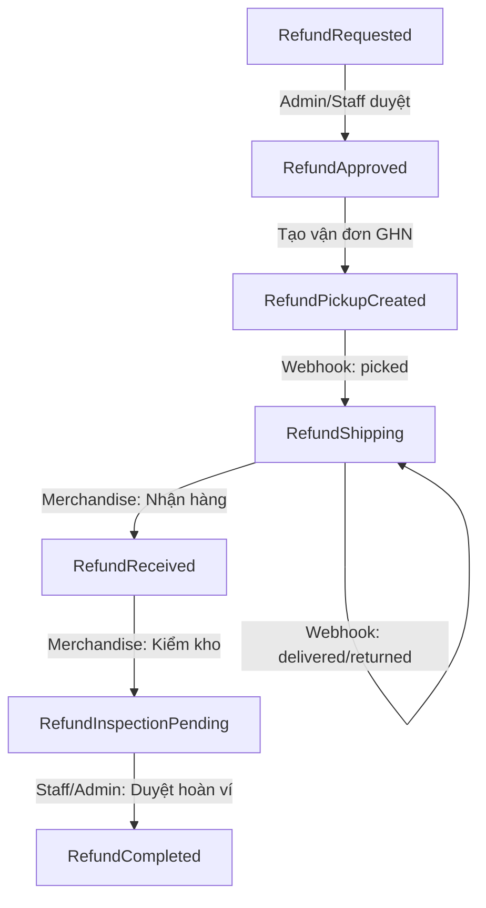

# Hướng Dẫn Giả Lập Webhook GHN Cho Luồng Trả Hàng & Hoàn Tiền (Refund)

Tài liệu này hướng dẫn cách ánh xạ trạng thái vận chuyển từ GHN Webhook sang các trạng thái **Refund** (hoàn trả hàng từ khách hàng về shop), kèm theo các kịch bản kiểm thử bằng lệnh **cURL** và **SQL** hỗ trợ.

---

## 1. BẢNG ÁNH XẠ TRẠNG THÁI GHN WEBHOOK SANG REFUND

Khi shop tạo vận đơn thu hồi hàng hoàn thông qua cổng giao vận GHN, hệ thống sẽ tự động bắt webhook và đồng bộ trạng thái đơn Refund như sau:

| Trạng thái thô GHN | Ý nghĩa nghiệp vụ | ID Refund | Trạng thái Refund hệ thống | Ghi chú / Hành động kế tiếp |
| :--- | :--- | :---: | :--- | :--- |
| **`ready_to_pick`**<br>**`storing`** | Vừa tạo đơn vận chuyển thu hồi / đã phân loại kho | **`4`** | `RefundPickupCreated` | Chờ shipper đến nhà khách lấy hàng trả |
| **`picking`**<br>**`picked`**<br>**`transporting`**<br>**`sorting`**<br>**`delivering`**<br>**`money_collect_delivering`**<br>**`returning`**<br>**`return_transporting`**<br>**`return_sorting`**<br>**`delivered`**<br>**`returned`** | Shipper đang đi lấy hàng / Đã lấy hàng thành công / Đang luân chuyển hàng về shop / Shipper đã giao thành công | **`5`** | `RefundShipping` | Hàng đang trên đường chuyển hoàn / Shipper đã giao thành công về kho shop. **Kho (Merchandise) phải click nút nhận hàng để chuyển trạng thái.** |
| **Hành động thủ công (Merchandise)** | **Quản lý sản phẩm nhận hàng hoàn** | **`6`** | `RefundReceived` | Đã hoàn thành việc nhận hàng tại bưu cục/kho. **Merchandise chuyển sang kiểm kho** (`RefundInspectionPending`). |
| **`cancel`**<br>**`delivery_fail`**<br>**`return_fail`**<br>**`lost`**<br>**`damage`**<br>**`exception`** | Sự cố phát sinh: Khách hủy không trả / Mất hàng / Hỏng hàng trong quá trình thu hồi | **`9`** | `RefundCancelled` | Hủy đơn Refund tự động do sự cố giao vận. Ghi log lỗi để Admin xử lý thủ công với GHN. |

---

## 2. VÒNG ĐỜI TEST ĐƠN REFUND THỰC TẾ



### Các bước chuẩn bị trước Webhook:
1. **Khách hàng** gửi yêu cầu hoàn tiền (`RefundRequested`).
2. **Admin** duyệt duyệt yêu cầu (`RefundApproved`).
3. **Admin** bấm **"Create Waybill"** (mã đơn GHN được gán vào cột `ShippingOrderCode`, trạng thái chuyển thành `RefundPickupCreated`).

---

## 3. KỊCH BẢN GIẢ LẬP WEBHOOK GHN (CURL)

Mở PowerShell và khai báo các biến môi trường để chạy các lệnh cURL bên dưới:

```powershell
$GhnCode = "LXDLBQ_RETURN" # Thay bằng mã ShippingOrderCode thực tế của đơn Refund đang test
$BaseUrl = "https://localhost:7083/api/webhooks/ghn"
$Token   = "fDoaiBJjrN3jc2Re4SIUZgZdNz5HzsPup6BRutbmXlh"
```

---

### KỊCH BẢN A: LUỒNG TRẢ HÀNG THÀNH CÔNG (HAPPY PATH)

#### Bước A1: Tiếp nhận thông tin trả hàng (`ready_to_pick`)
*Trạng thái hệ thống chuyển: `RefundPickupCreated` (3)*
```powershell
curl -X POST "$BaseUrl" `
-H "X-Webhook-Token: $Token" `
-H "Content-Type: application/json" `
-d "{
    `"OrderCode`": `"$GhnCode`", `"Status`": `"ready_to_pick`", `"Type`": `"create`", `"Time`": `"2026-05-31T10:00:00.000Z`"
}"
```

#### Bước A2: Shipper đã lấy được hàng hoàn từ khách (`picked`)
*Trạng thái hệ thống chuyển: `RefundShipping` (4) - Bắt đầu quá trình vận chuyển*
```powershell
curl -X POST "$BaseUrl" `
-H "X-Webhook-Token: $Token" `
-H "Content-Type: application/json" `
-d "{
    `"OrderCode`": `"$GhnCode`", `"Status`": `"picked`", `"Type`": `"switch_status`", `"Time`": `"2026-05-31T10:30:00.000Z`"
}"
```

#### Bước A3: Shipper đang chuyển hoàn sản phẩm về kho (`transporting`)
*Trạng thái hệ thống giữ nguyên: `RefundShipping` (4) - Ghi nhật ký vận chuyển*
```powershell
curl -X POST "$BaseUrl" `
-H "X-Webhook-Token: $Token" `
-H "Content-Type: application/json" `
-d "{
    `"OrderCode`": `"$GhnCode`", `"Status`": `"transporting`", `"Type`": `"switch_status`", `"Time`": `"2026-05-31T11:00:00.000Z`"
}"
```

#### Bước A4: Shipper giao hàng hoàn thành công về kho Shop (`returned`)
*Trạng thái hệ thống chuyển: `RefundReceived` (5) - Shop đã nhận lại hàng*
```powershell
curl -X POST "$BaseUrl" `
-H "X-Webhook-Token: $Token" `
-H "Content-Type: application/json" `
-d "{
    `"OrderCode`": `"$GhnCode`", `"Status`": `"returned`", `"Type`": `"switch_status`", `"Time`": `"2026-05-31T12:00:00.000Z`"
}"
```

> **Hành động sau khi nhận hàng (UI Admin/Kho):**
> 1. Staff bấm nút chuyển sang **Quality Inspection** (`RefundInspectionPending`).
> 2. Merchandise/Admin thực hiện kiểm kho, ghi note và hoàn tất đơn hàng (`RefundCompleted`). Tiền tự động hoàn về ví ví khách hàng.

---

### KỊCH BẢN B: SỰ CỐ VẬN CHUYỂN (HỦY ĐƠN / MẤT HÀNG / HỎNG HÀNG)

Nếu đơn vận chuyển thu hồi gặp sự cố, hệ thống sẽ tự động hủy yêu cầu hoàn tiền để quản lý kiểm soát thủ công.

#### Trường hợp B1: Đơn vận chuyển thu hồi bị hủy (`cancel`)
*Trạng thái hệ thống chuyển: `RefundCancelled` (9)*
```powershell
curl -X POST "$BaseUrl" `
-H "X-Webhook-Token: $Token" `
-H "Content-Type: application/json" `
-d "{
    `"OrderCode`": `"$GhnCode`", `"Status`": `"cancel`", `"Type`": `"switch_status`", `"Time`": `"2026-05-31T13:00:00.000Z`"
}"
```

#### Trường hợp B2: Giao hàng thất bại / Khách không đưa hàng (`delivery_fail`)
*Trạng thái hệ thống chuyển: `RefundCancelled` (9)*
```powershell
curl -X POST "$BaseUrl" `
-H "X-Webhook-Token: $Token" `
-H "Content-Type: application/json" `
-d "{
    `"OrderCode`": `"$GhnCode`", `"Status`": `"delivery_fail`", `"Type`": `"update`", `"Time`": `"2026-05-31T13:30:00.000Z`",
    `"ReasonCode`": `"GHN-DFC1A2`", `"Reason`": `"Khách hàng từ chối trả lại hàng`"
}"
```

#### Trường hợp B3: Hàng hóa bị mất / hỏng hoàn toàn trong quá trình thu hồi (`lost` / `damage`)
*Trạng thái hệ thống chuyển: `RefundCancelled` (9)*
```powershell
curl -X POST "$BaseUrl" `
-H "X-Webhook-Token: $Token" `
-H "Content-Type: application/json" `
-d "{
    `"OrderCode`": `"$GhnCode`", `"Status`": `"lost`", `"Type`": `"switch_status`", `"Time`": `"2026-05-31T14:00:00.000Z`"
}"
```

---

## 4. CÂU LỆNH SQL HỖ TRỢ KIỂM TRA DATABASE

### A. Truy vấn thông tin trạng thái Refund và vận đơn GHN liên kết:
```sql
SELECT 
    r.RefundID,
    r.RefundCode,
    rs.StatusName AS RefundStatus,
    r.ShippingOrderCode AS GhnWaybillCode,
    r.PaymentStatus,
    r.ApprovedAmount,
    r.UpdatedAt
FROM OrderRefunds r
INNER JOIN RefundStatuses rs ON r.StatusID = rs.StatusID
WHERE r.ShippingOrderCode = 'LXDLBQ_RETURN'; -- Thay bằng mã vận đơn của bạn
```

### B. Kiểm tra nhật ký lịch sử thay đổi trạng thái của Refund:
```sql
SELECT 
    h.HistoryID,
    rs.StatusName AS StatusTransition,
    h.Note,
    h.CreatedAt
FROM RefundStatusHistories h
INNER JOIN RefundStatuses rs ON h.StatusId = rs.StatusID
WHERE h.RefundId = (SELECT RefundID FROM OrderRefunds WHERE ShippingOrderCode = 'LXDLBQ_RETURN')
ORDER BY h.CreatedAt DESC;
```
